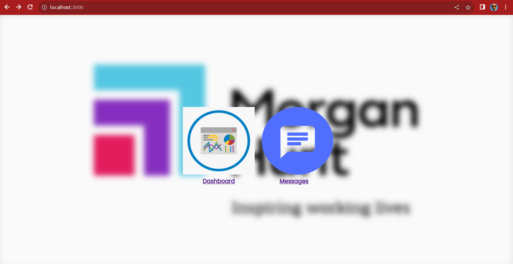
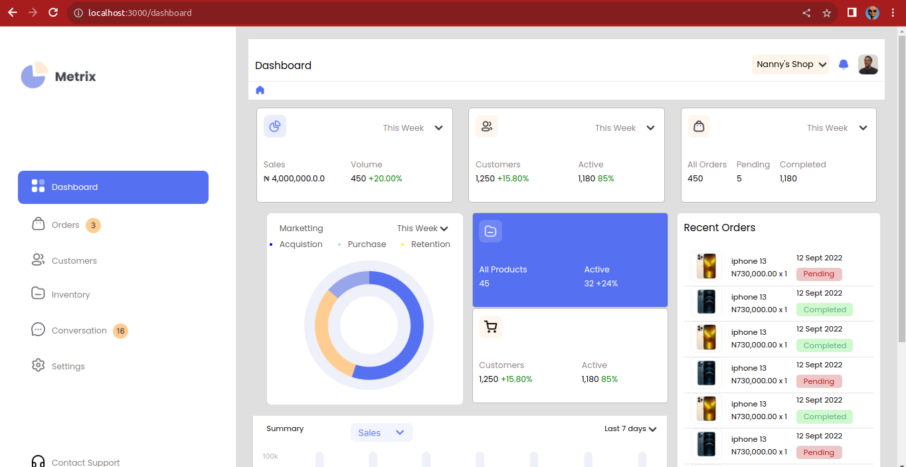
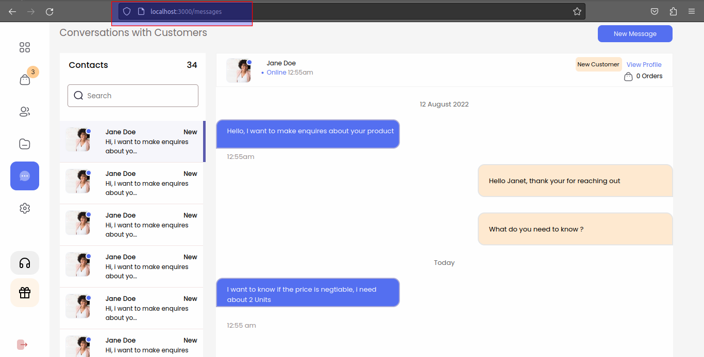

# Morgan Hunt's Test

# Software Frontend Developer Submission for React.js Project

## Project Overview

<div> 

</div>
<div>
    
</div>
<div>
    
</div>

This project was bootstrapped with [Create React App](https://github.com/facebook/create-react-app).

## Installation And Use

<p> Change directory into the project directory and execute the following commands </p>

```bash
    $ cd morganhunt-test
```

## Execute the following commands below

In the project directory, you can run:

```
$ npm install .
```

<p> Then after installation, execute the following commands below </p>

```
$ npm start
```

Hello,

I'm excited to present my submission for the software frontend developer position, showcasing my work on a React.js project. In this project, I have developed a web application with the following routes:

1. **Home Page**: [http://146.190.171.44:3000/](http://146.190.171.44:3000/)
2. **Dashboard Page**: [http://146.190.171.44:3000/dashboard](http://146.190.171.44:3000/dashboard)
3. **Message Page**: [http://146.190.171.44:3000/messages](http://146.190.171.44:3000/messages)

## Project Features

### 1. Home Page

The Home Page serves as the landing page for the application. It provides an introduction to the application and may include essential features like:

- An attractive and user-friendly interface.
- Key information or highlights about the application.
- Navigation elements to other pages.
- Call-to-action buttons to encourage user engagement.

### 2. Dashboard Page

The Dashboard Page is the main section of the application, where users can access various functionalities and data relevant to their accounts. Key features of the Dashboard Page include:

- A personalized view for each user, showing relevant data and information.
- Access to account settings and user preferences.
- Visualizations, charts, or graphs to present data in an intuitive manner.
- Ability to perform actions or operations related to the application's core functionality.

### 3. Message Page

The Message Page facilitates communication between users within the application. It may include features such as:

- Displaying a list of messages or conversations.
- Options to send, receive, and reply to messages.
- Notifications for new messages.
- Message search and filtering capabilities.

## Technology Stack

In developing this project, I utilized the following technologies:

- **React.js**: The core frontend library to build user interfaces efficiently.
- **React Router**: For managing application routing and navigation.
- **HTML5 & CSS3**: To structure and style the web pages.
- **Axios**: For handling HTTP requests and interacting with the backend (if applicable).

## Code Repository and Live Demo

The source code for this project can be found on my GitHub repository at [github.com/yourusername/react-app](https://github.com/yourusername/react-app). Additionally, you can access the live demo of the application deployed at [http://146.190.171.44:3000/](http://146.190.171.44:3000/).

## Usage

To run this project locally on your machine, follow these steps:

1. Ensure you have Node.js and npm (Node Package Manager) installed on your system.
2. Clone the project repository from [github.com/yourusername/react-app](https://github.com/yourusername/react-app).
3. Navigate to the project directory in the terminal.
4. Install the required dependencies using `npm install`.
5. Start the development server using `npm start`.

The application will be accessible at [http://localhost:3000/](http://localhost:3000/).

## Conclusion

I'm proud of the work I've accomplished on this React.js project, and I believe it showcases my skills and expertise as a frontend developer. I hope you find the application engaging and user-friendly.

Thank you for considering my submission. I look forward to discussing the project further and the opportunity to contribute to your team.

Best regards,

<header>
Mbonu Chinedum <br>
cmbonu@protonmail.com <br>

</header>
